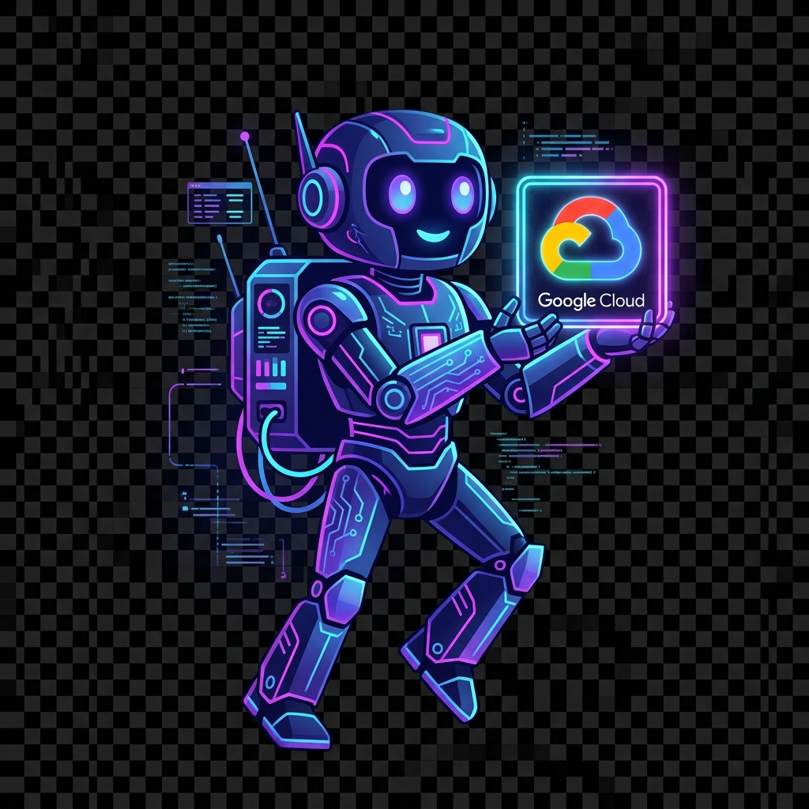
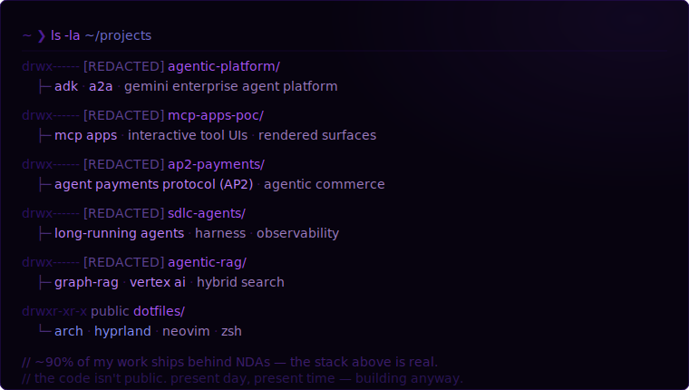
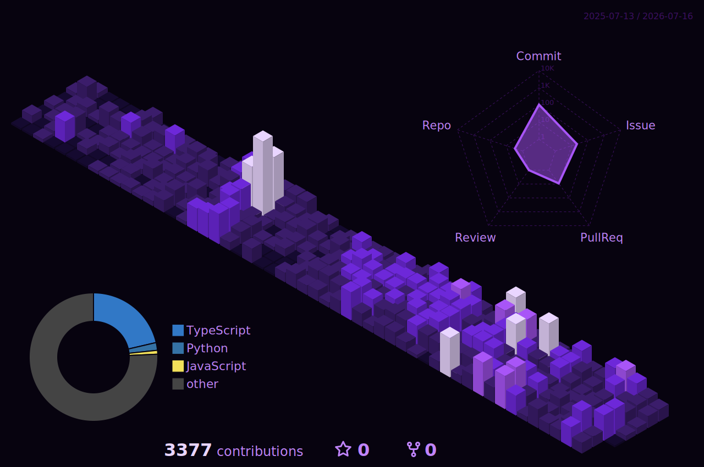

 

 

 

&nbsp;

&nbsp;

&nbsp;

---

---

---

 

---

  

 

<i>the streak is the point — code / prompt / ship, daily, no exceptions.</i>

---

---

---

---

---

<i>reverse-engineering by night &middot; teaching machines to move &middot; exploring the edges</i>

  

<!-- FORTUNE:START -->
<i>shipped is better than perfect. perfect never ships.</i>
<!-- FORTUNE:END -->

  

<a href="https://www.linkedin.com/in/khalid-a-3b2813192/">linkedin</a>

<!--
  still here? the wired is vast and infinite, and most of what's real
  in this profile is redacted. the streak up top isn't. — khalid
-->

