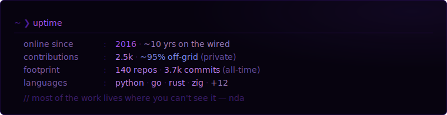
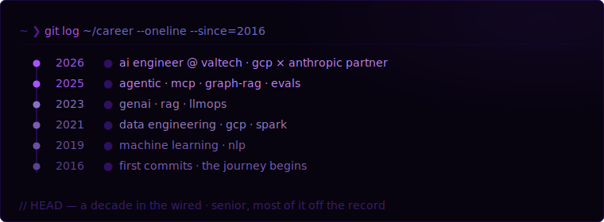
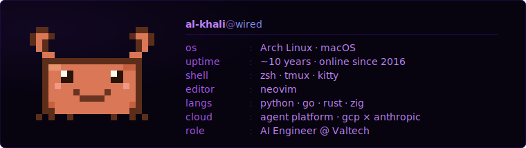

<i>— serial experiments lain · layer:07</i>

 

 

 

&nbsp;

&nbsp;

&nbsp;

---

 

---

---

---

---

---

---

---

 

<picture>
  <source media="(prefers-color-scheme: dark)" srcset="https://raw.githubusercontent.com/al-khali/al-khali/output/github-snake-dark.svg" />
  <source media="(prefers-color-scheme: light)" srcset="https://raw.githubusercontent.com/al-khali/al-khali/output/github-snake.svg" />
  
</picture>

---

---

 

<i>the network is vast and infinite.</i>

 

<code>root@wired</code> · reverse-engineering by night · teaching machines to move

  

<a href="https://www.linkedin.com/in/khalid-a-3b2813192/">linkedin</a>

